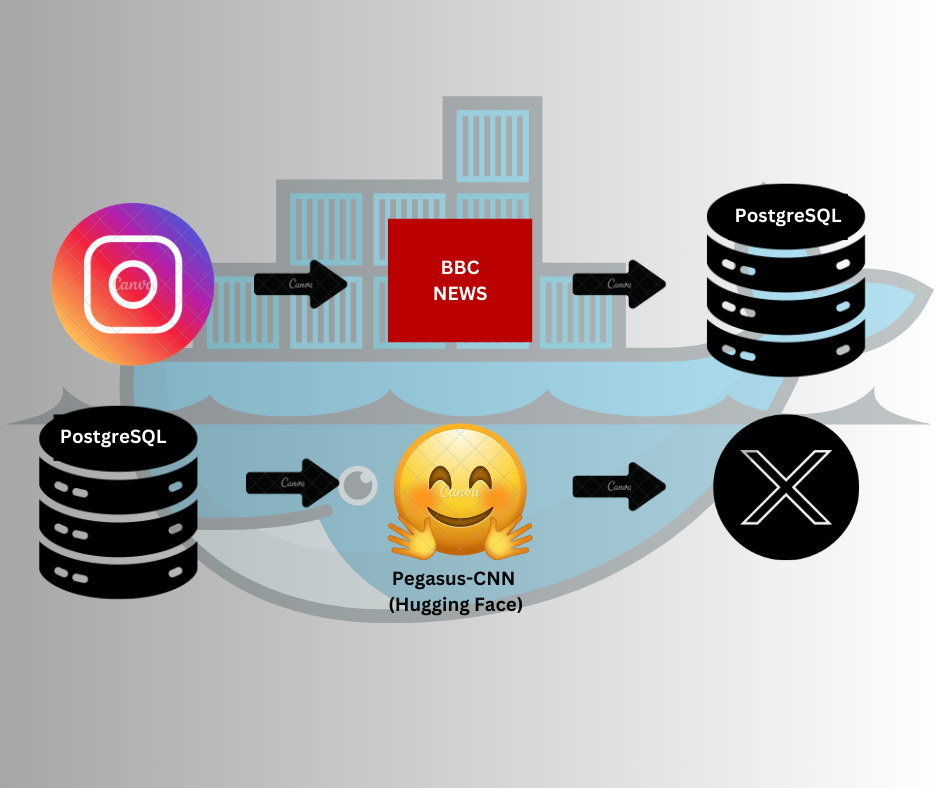

# Instagram-Caption-Summarizer-X.com

This project automates fetching captions from Instagram, storing them in PostgreSQL, and summarizing and posting them to Twitter with or without image — all in Docker containers.



## Architecture Diagram

```plaintext
        +-----------------------------+
        |         Docker Compose      |   
        |        (Manages Services)   | 
        +-----------------------------+
           |                      |
           |                      |
           v                      v
+------------------+      +-----------------------+
| Instagram to     |      | PostgreSQL to Twitter |
| PostgreSQL       |      | Service (Summarize &  |
| Service          |      | Post to Twitter)      |
+------------------+      +-----------------------+
           |                      |
           |                      |
           v                      v
+------------------+      +-----------------------+
| Instagram        |      |       Summarizer      |
|  Captions        |      |     (Hugging          |
|     & Images     |      |   Face Pegasus-CNN)   |
+------------------+      +-----------------------+
           |                       |
           |                       |
           v                       v
+-----------------+       +-------------------------+                          
|  PostgreSQL     |       |    X.com Twitter API    |
|   Database      |       |    (Post Summarized     |
|                 |       |     Tweets)             |
+-----------------+       +-------------------------+
```


# Features
- Fetch Instagram captions and store them in a PostgreSQL database.
- Summarize captions using Pegasus-CNN (Hugging Face).
- Post summarized captions as tweets via Twitter API.
- Fully Dockerized: Easy to deploy and manage.

# Prerequisites
Ensure you have the following installed:

Docker
Docker Compose

open terminal
Check Docker Version: Ensure Docker is correctly installed:
    docker --version
    docker-compose --version

# Project Structure
The project is organized into two main services:

```plaintext
insta_to_twitter_docker/
├── docker-compose.yml                    # Manage both services 
│
├── instagram_to_postgres/                # Service to fetch and store captions and images
│    ├── Dockerfile                       # Docker image setup for Instagram service
│    ├── __init__.py                      # Package initialization file
│    ├── instagram_scraper.py             # Instagram caption and image scraping logic
│    ├── insta_post_to_postgres.py        # Logic for storing captions and images in PostgreSQL
│    ├── config.py                        # Configuration file (DB and Instagram credentials)
│    ├── utils.py                         # Utility functions (e.g., logging setup)
│    ├── README.md                        # Instructions for this service
│    └── tests                            # Unit test
│          └── test_scraper.py
|
└── postgres_to_twitter/                  # Service to summarize and tweet it with or without image
     ├── Dockerfile                       # Docker image setup for Twitter posting service
     ├── __init__.py                      # Package initialization file
     ├── app.py                           # Streamlit app for UI
     ├── summarizer.py                    # Summarization and Twitter posting logic
     ├── config.py                        # Configuration file (API keys, DB credentials)
     ├── utils.py                         # Utility functions (e.g., logging setup)
     └── README.md                        # Instructions for this service
     └── tests                            # Unit test
          └── test_summarizer.py
```


# Setup Instructions

1. Clone the Repository:
    git clone https://github.com/yourusername/Instagram-Caption-Summarizer-X.com.git


2. Configure with the following content in config.py:

    # PostgreSQL Configuration (shared by both services)
    POSTGRES_USER=your_postgres_username
    POSTGRES_PASSWORD=your_postgres_password
    POSTGRES_DB=insta_posts_db
    
    # Twitter API (for postgres_to_twitter service)
    TWITTER_API_KEY=your_twitter_api_key
    TWITTER_API_SECRET_KEY=your_twitter_api_secret
    ACCESS_TOKEN=your_twitter_access_token
    ACCESS_TOKEN_SECRET=your_twitter_access_token_secret


3. cd instagram-to-twitter

4. To build and start the Docker containers:
    docker-compose up --build

    If you want to run it in detached mode (in the background):
    docker-compose up -d

5. Access the Services:
    - Instagram to PostgreSQL: Runs in the background, fetching and storing data from Instagram.
    - PostgreSQL: Available at localhost:5432.
    - Streamlit App (Twitter Posting): http://localhost:8501

6. Run Tests manually:
    - docker-compose run --rm instagram_to_postgres pytest tests/test_scraper.py
    - docker-compose run --rm postgres_to_twitter pytest tests/test_summarizer.py

# Usage Guide

- Check Captions: The Instagram service fetches captions and stores them in the PostgreSQL database. You don't need to interact with it directly as it runs in the background.

- Summarize and Tweet: Use the Streamlit UI to generate a summarized caption and post it to Twitter. You will see a "Summarize and Post Tweet" button that will trigger the summarization and posting process.

# Database Schema
Ensure your PostgreSQL database has the following schema:

CREATE TABLE IF NOT EXISTS instagram_posts (
          id SERIAL PRIMARY KEY,
          caption TEXT UNIQUE,
          image_url TEXT,
          created_at TIMESTAMP DEFAULT CURRENT_TIMESTAMP
      );

# Container Management Commands
    **Docker Commands**
    
    - Start the Entire System (Instagram, PostgreSQL, and Twitter services):
        docker-compose up
    
    - Rebuild Docker Images (to apply changes):
        docker-compose up --build
    
    - Monitor the Logs: View real-time logs:
        docker-compose logs -f
    
    - Check Active Containers:
        docker ps
    
    - Access Containers: To access a running container (e.g., postgres_to_twitter), run:
        docker exec -it postgres_to_twitter bash
    
    - Stop the Services: To stop all services (containers) running:
        docker-compose down
    
    - Remove Volumes (if needed): If you want to remove volumes (including data in the PostgreSQL database):
        docker-compose down -v
    
    - Remove Stopped Containers and Images (if needed):
        docker system prune -af

# Troubleshooting

Common Errors:

    1. urllib3.exceptions.NewConnectionError
    If you encounter connection issues, ensure that all containers and networks are removed:
        docker-compose down --volumes --remove-orphans
    Then, recreate the network:
    docker network create selenium_network
    
    2. ARM64 Architecture Support with Selenium
    - If you're running on an ARM64-based architecture (e.g., Apple M1/M2 or ARM-based servers) and experience issues with the default Selenium image, you can attempt to use selenium/standalone-chrome-debug which may have better support for ARM64.
    - To ensure compatibility with ARM64, force Docker to use the ARM64 platform by specifying the platform as follows:
         docker pull --platform linux/arm64/v8 selenium/standalone-chrome-debug
    - This will pull the appropriate version of the image for ARM64 and should resolve compatibility issues. After pulling the image, you can continue with the normal setup as described in the rest of the README.

# Notes:

- Ensure the __init__.py file exists in both the instagram_to_postgres and postgres_to_twitter directories. This file is required for Python to treat these directories as packages and allow for imports.

- .yml file indentation sensitive

# Extending the Project

- Add More Summarization Models: Replace the Pegasus-CNN model with other Hugging Face models if desired.

- Support Multiple Social Platforms: Extend the summarizer to post captions to LinkedIn, Facebook, or other platforms.
